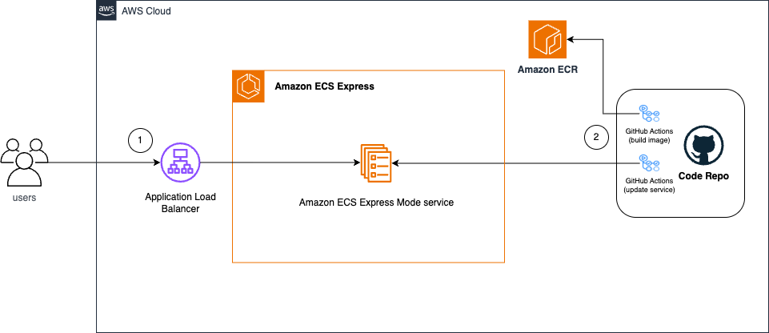

# Web Application Deployment in Amazon ECS Express Mode 

This project demonstrates deploying a React web application to Amazon ECS with automated CI/CD pipeline using GitHub Actions.

## Architecture Overview



## Project Structure

## Features

- **React Application**: Modern React app with TypeScript support
- **Containerized Deployment**: Docker-based deployment with Nginx
- **CI/CD Pipeline**: Automated build and deployment using GitHub Actions
- **ECS Integration**: Seamless deployment to Amazon ECS Express Mode
- **Health Monitoring**: Built-in health check endpoint

## Quick Start

### Prerequisites
- AWS CLI configured with appropriate permissions
- Docker installed locally
- Node.js and npm installed

### Local Development

```bash
# Install dependencies
npm install

# Start development server
npm start

# Build for production
npm run build

# Run tests
npm test
```

### Docker Deployment

```bash
# Build Docker image
docker build -t express-web-app .

# Run container locally
docker run -p 8080:8080 express-web-app
```

### Create Amazon ECR repo `ecs-express-mode-sample`

```bash
./push-to-ecr.sh
```

### Create Express Mode service

With the basic GitHub Actions workflow in `.github/workflows` you can establish an automated pipeline that builds your application, packages it into a container image, and deploys it to ECS Express Mode.

```bash
- name: Deploy to ECS Express Mode
  uses: aws-actions/amazon-ecs-deploy-express-service@v1
  with:
    service-name: my-service
    image: 123456789012.dkr.ecr.us-east-1.amazonaws.com/my-app:latest
    execution-role-arn: arn:aws:iam::123456789012:role/ecsTaskExecutionRole
    infrastructure-role-arn: arn:aws:iam::123456789012:role/ecsInfrastructureRole
```

## Learn More

- [Amazon ECS Documentation](https://docs.aws.amazon.com/ecs/)
